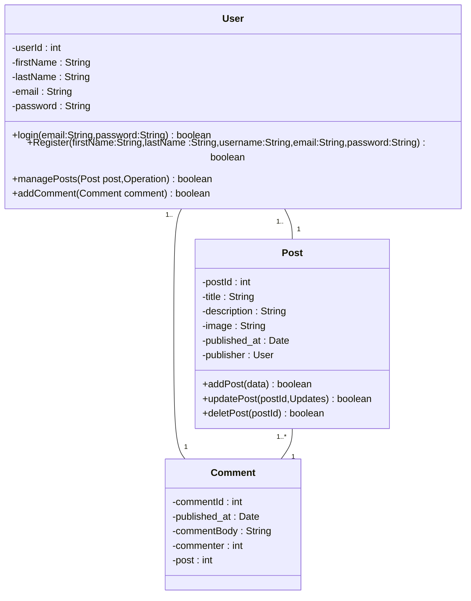

```mermaid
classDiagram
    class User{
     -userId : int
     -firstName : String
     -lastName : String
     -email : String
     -password : String
     +login(email:String,password:String) boolean
     +Register(firstName:String,lastName :String,username:String,email:String,password:String) boolean
     +managePosts(Post post,Operation) boolean
     +addComment(Comment comment) boolean
    }
    class Post{
     -postId : int
     -title : String
     -description : String
     -image : String
     -published_at : Date
     -publisher : User
     +addPost(data) boolean
     +updatePost(postId,Updates) boolean
     +deletPost(postId) boolean
    }
    class Comment{
        -commentId : int
        -published_at : Date
        -commentBody : String
        -commenter : int
        -post : int
    }
    User "1.."--"1"Post
    User "1.."--"1"Comment
    Post "1..*"--"1" Comment
```
